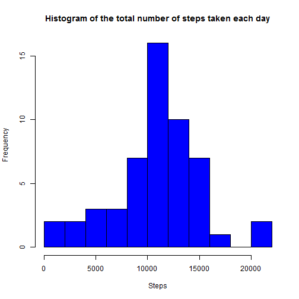
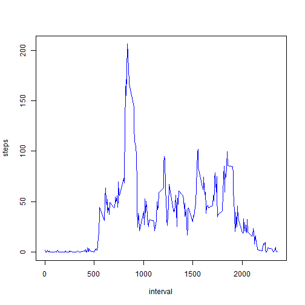
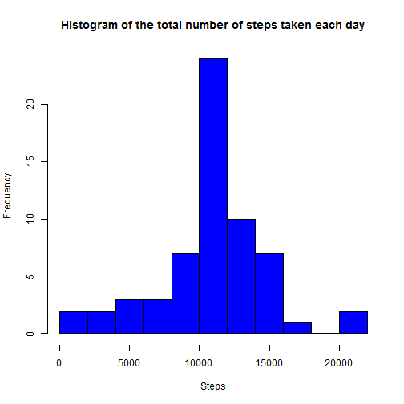
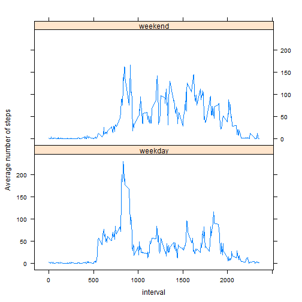

```r
library(dplyr, warn.conflicts = FALSE, quietly = TRUE)
library(lubridate, warn.conflicts = FALSE, quietly = TRUE)
library(lattice, warn.conflicts = FALSE, quietly = TRUE)
library(knitr, warn.conflicts = FALSE, quietly = TRUE)
```

## Loading and preprocessing the data


```r
unzip("activity1.zip")

activity_data <- read.csv("activity.csv")
```


## What is mean total number of steps taken per day?

```r
by_day <- group_by(activity_data, date)

total_dailysteps <- summarise(by_day, sum(steps))

colnames(total_dailysteps) <- c("date", "steps")

hist(total_dailysteps$steps, breaks = 10, main = "Histogram of the total number of steps taken each day", xlab = "Steps", col = "blue")
```

 

```r
options(scipen = 6)

mean_total_dailysteps <- round(mean(total_dailysteps$steps, na.rm=TRUE),3)

median_total_dailysteps <- round(median(total_dailysteps$steps, na.rm=TRUE),3)
```

* The mean of the total number of steps taken per day is 10766.189

* The median of the total number of steps taken per day is 10765

## What is the average daily activity pattern?


```r
by_fivemin_interval <- group_by(activity_data, interval)

mean_steps_fivemin <- summarise(by_fivemin_interval, mean(steps, na.rm=TRUE))

colnames(mean_steps_fivemin) <- c("interval", "steps")

plot(mean_steps_fivemin, type="l", col = "blue")
```

 

```r
int_with_max_steps <- mean_steps_fivemin[which(mean_steps_fivemin[,2] == max(mean_steps_fivemin$steps)),1]
```

* The 5-minute interval, on average across all the days in the dataset, that contains the maximum number of steps is 835

## Imputing missing values


```r
NAs_data <- sapply(activity_data$steps, is.na)

total_NAs <- sum(NAs_data == TRUE)
```

* Total number of missing values in the data set = 2304

To fill in all of the missing values in the dataset, I have used the mean for that 5-minute interval across all days. Using this strategy, I generated a new data set called new_activity_data


```r
new_activity_data <- activity_data

for(i in 1:nrow(new_activity_data)) {
        
        if(is.na(new_activity_data[i,1])) {
                
                new_activity_data[i, 1] <- mean_steps_fivemin[which(mean_steps_fivemin$interval == new_activity_data[i, 3]),2]
        }
        
}


new_by_day <- group_by(new_activity_data, date)

new_total_dailysteps <- summarise(new_by_day, sum(steps))

colnames(new_total_dailysteps) <- c("date", "steps")

hist(new_total_dailysteps$steps, breaks = 10, main = "Histogram of the total number of steps taken each day", xlab = "Steps", col = "blue")
```

 

```r
new_mean_total_dailysteps <- round(mean(new_total_dailysteps$steps, na.rm=TRUE),3)

new_median_total_dailysteps <- round(median(new_total_dailysteps$steps, na.rm=TRUE),3)
```

* The mean of the total number of steps taken per day is 10766.189

* The median of the total number of steps taken per day is 10766.189


## Are there differences in activity patterns between weekdays and weekends?

Below code creates a new factor variable in the dataset with two levels - "weekday" and "weekend" indicating whether a given date is a weekday or weekend day.


```r
new_activity_data$day <- ifelse(weekdays(strptime(new_activity_data$date, "%Y-%m-%d")) %in% c("Saturday", "Sunday"), "weekend","weekday" )
```

Below code creates a panel plot comparing the average number of steps taken per 5-minute interval across weekdays and weekends.


```r
new_by_day2 <- group_by(new_activity_data, interval, day)

new_mean_steps_int_day <- summarise(new_by_day2, mean(steps))

colnames(new_mean_steps_int_day) <- c("interval", "day", "avg_steps")

xyplot(new_mean_steps_int_day$avg_steps ~ new_mean_steps_int_day$interval | new_mean_steps_int_day$day, layout = c(1,2), type = "l", xlab = "interval", ylab = "Average number of steps")
```

 

